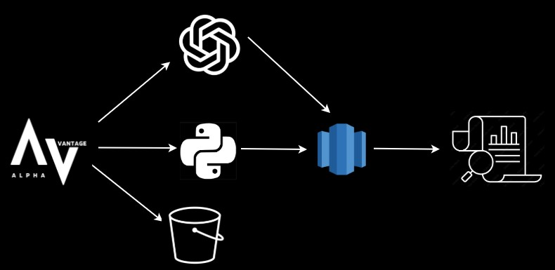

# AWS-Native Stock Data Pipeline with AI-Driven Insights

This repository implements an end-to-end ETL (Extract, Transform, Load) pipeline for daily time-series stock data. It retrieves daily pricing information from the Alpha Vantage API, enriches that data with AI-generated sentiment using OpenAI’s API, and uploads the raw JSON responses to S3. The processed data insclude open, high, low, close, volume, fields along with an AI-geeneated sentiment per stock, that is then stored in an AWS Redshift database. The Redshift methods support append, replace, or upsert operations to enable flexible downstream analysis.  The repository also includes configuration files for API settings and database connection details, making it a comprehensive solution for automated financial data ingestion and analysis.

<div align="center">
  
</div>

## Features
- **Wrapper around AWS services:** Provides seamless integration with AWS services like S3 and Redshift, abstracting complexities and enabling users to focus on downstream analytics rather than infrastructure management.
- **Comprehensive Data Extraction:** Retrieves daily pricing data from a financial API, including key metrics such as opening price, high, low, closing price, and volume.
- **AI-Powered Sentiment Analysis:** Leverages OpenAI's API to generate sentiment insights for financial data, providing additional context for decision-making.
- **Flexible Data Storage:** Supports multiple write methods (append, replace, and upsert) for storing processed data in AWS Redshift, ensuring compatibility with various use cases.
- **Cloud Integration:** Automatically uploads raw JSON data to Amazon S3 for long-term storage and backup.
- **Error Handling and Logging:** Includes robust error handling and logging mechanisms to ensure smooth operation and easier debugging.
- **Configurable Pipeline:** Allows users to customize API keys, database connection details, and other settings through configuration files.
- **Scalable Design:** Designed to handle large datasets efficiently, making it suitable for enterprise-level applications.

## Usage

1. Configure the API and database settings in the `configs` folder.
2. Run the ETL pipeline:
   ```bash
   python main.py
   ```

## Configuration

- **API Settings:** Configure API keys and endpoints in `configs/api.py`.
- **Database Settings:** Set up Redshift connection details in the same configuration file.
